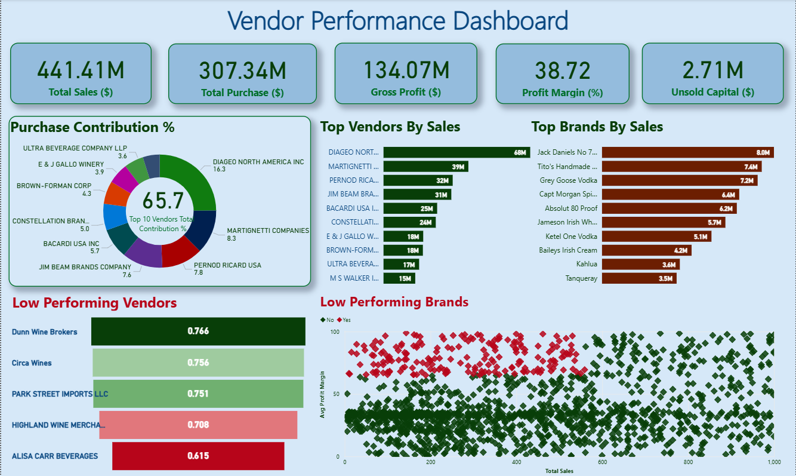

# 📊 Vendor Performance Analysis | Inventory and sales

## 📌 One-Line Objective
Analyzed vendors and inventory performance to identify profitability drivers, strategic purchasing, inventory decision and optimization opportunities using SQL, Python, and data visualization.

----------

## 📑 Table of Contents
- <a href="#overview">Overview</a>
- <a href="#business-problem">Business Problem</a>
- <a href="#dataset">Dataset</a>
- <a href="#tools--technologies">Tools & Technologies</a>
- <a href="#data-cleaning--preparation">Data Cleaning & preparation</a>
- <a href="#exploratory-data-analysis-eda">Exploratory Data Analysis (EDA)</a>
- <a href="#research-questions--key-findings">Research Questions & Key Findings</a>
- <a href="#dashboard">Dashboard</a>
- <a href="#how-to-run-this-project">How to Run This Project</a>
- <a href="#final-recommendation">Final Recommendation</a>
- <a href="#author--contact">Author & Contact</a>


----------

<h2><a class="anchor" id="overview"></a>Overview</h2>

This project analyzes vendor performance and retail inventory dynamics to generate data-driven insights for purchasing, pricing, and inventory optimization. An end-to-end analytics pipeline was developed using SQL for ETL and data preparation, Python for exploratory analysis and statistical hypothesis testing, and Power BI for interactive dashboarding and business reporting. The analysis supports strategic decision-making by identifying profitability drivers, vendor concentration risks, bulk purchasing benefits, and inventory inefficiencies.

----------

<h2><a class="anchor" id="business-problem"></a>Business Problem</h2>

Effective inventory and sales management are critical in the retail sector. This project aims to:

- Identify underperforming brands that require pricing or promotional adjustments.

- Evaluate vendor contributions to overall sales and profitability.

- Analyze the cost–benefit of bulk purchasing strategies.

- Investigate inefficiencies in inventory turnover.

- Statistically validate differences in vendor profitability.

----------

<h2><a class="anchor" id="dataset"></a>Dataset</h2>

- **Type:** Retail & Wholesale Transactional Data  
- **Records:** ~10,000+ rows  
- **Key Fields:**  
  - Vendor details  
  - Brand information  
  - Purchase price & quantity  
  - Sales price & quantity
  - Freight cost  
  - Gross profit & profit margin  
- **Source:** Provided as CSV files (stored in the `/data` directory)

----------

<h2><a class="anchor" id="tools--technologies"></a>Tools & technologies</h2>

- **SQL / MySQL** – Data extraction and aggregation  
- **Python** – Data cleaning and analysis  
- **Power BI** – Dashboard creation  
- **GitHub** – Version control and project hosting  

----------

<h2><a class="anchor" id="data-cleaning--preparation"></a>Data Cleaning & Preparation</h2>

## Data Cleaning & Preparation

To ensure reliable analysis, the dataset was filtered to remove non-representative records:

- Excluded transactions with **Gross Profit ≤ 0**
- Removed records with **non-positive profit margins**
- Eliminated products with **zero total sales quantity**

This cleaning ensured the analysis focused on **profitable, completed transactions**, improving the accuracy of vendor performance and inventory insights.

----------

<h2><a class="anchor" id="exploratory-data-analysis-eda"></a>Exploratory Data Analysis (EDA)</h2>
### Key EDA Insights

**Data Quality Issues**
- Presence of loss-making transactions due to negative or zero gross profit
- Non-positive profit margins driven by zero or below-cost sales
- Unsold inventory indicating slow-moving or obsolete stock

**Outlier Patterns**
- Significant variability in freight costs, with extreme high-cost shipments
- Wide dispersion in purchase and actual prices, reflecting product mix diversity

**Correlation Findings**
- Weak relationship between purchase price and overall profitability
- Strong alignment between purchase quantity and sales quantity (≈ 0.999), indicating efficient inventory movement
- Negative relationship between profit margin and sales price, suggesting pricing pressure impacts margins

----------

<h2><a class="anchor" id="research-questions--key-findings"></a>Research Questions & Key Findings</h2>

### Key EDA Insights

**Data Quality Issues**
- Presence of loss-making transactions due to negative or zero gross profit
- Non-positive profit margins driven by zero or below-cost sales
- Unsold inventory indicating slow-moving or obsolete stock

**Outlier Patterns**
- Significant variability in freight costs, with extreme high-cost shipments
- Wide dispersion in purchase and actual prices, reflecting product mix diversity

**Correlation Findings**
- Weak relationship between purchase price and overall profitability
- Strong alignment between purchase quantity and sales quantity (≈ 0.999), indicating efficient inventory movement
- Negative relationship between profit margin and sales price, suggesting pricing pressure impacts margins

----------

<h2><a class="anchor" id="dashboard"></a>Dashboard</h2>
A vendor performance dashboard was created to visualize key insights, including:
- Total sales, purchases, gross profit, and profit margin
- Vendor contribution percentages
- Top vendors and brands by sales
- Low-performing vendors and brands
- Unsold inventory value

**Dashboard Screenshot Placeholder:**



----------

<h2><a class="anchor" id="how-to-run-this-project"></a>How to Run This Project</h2>

1. Clone the repository:
```bash
git clone https://github.com/shubham0-19/vendor-performance-analysis-python-sql-powerbi.git
```
2. Load CSVs and ingest into database:
```bash
python Scripts/ingestion_db.py
```
3. Create vendor summary table:
```bash
python scripts/get_vendor_summary.py
```
4. Open and run notebooks:
   - 'Notebooks/Exploratory Data Analysis.ipynb'
   - 'Notebooks/Vendor Performance Analysis.ipynb'
5. Open Power BI Dashboard:
   - 'Dashboard/vendor_performance.pbix'

----------

<h2><a class="anchor" id="final-recommendation"></a>Final Recommendation</h2>

Based on the analysis, the following actions are recommended to improve profitability and inventory efficiency:

- Optimize pricing and promotions for low-sales, high-margin brands to increase demand without reducing margins.
- Reduce vendor concentration risk by diversifying supplier partnerships.
- Leverage bulk purchasing for high-demand products to benefit from lower unit costs while avoiding overstocking.
- Minimize slow-moving and unsold inventory through better purchase planning and clearance strategies.
- Apply differentiated strategies for high and low-performing vendors based on their profitability patterns.

----------

<h2><a class="anchor" id="author--contact"></a>Author & Contact</h2>

**Shubham Prakash**

Email: prakashshubham60@gmail.com

LinkedIn: [LinkedIn](www.linkedin.com/in/shubhamdata)


